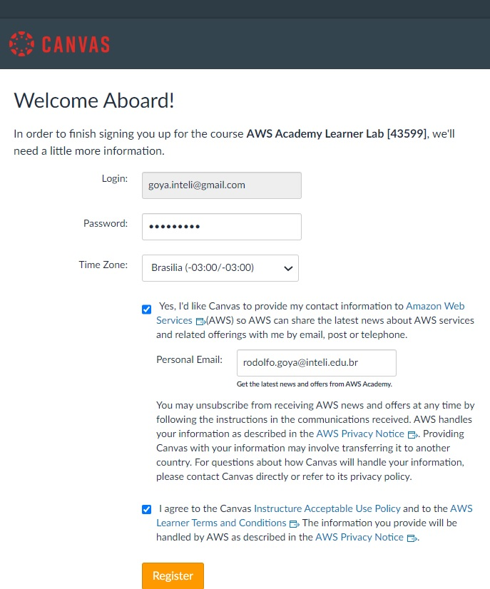
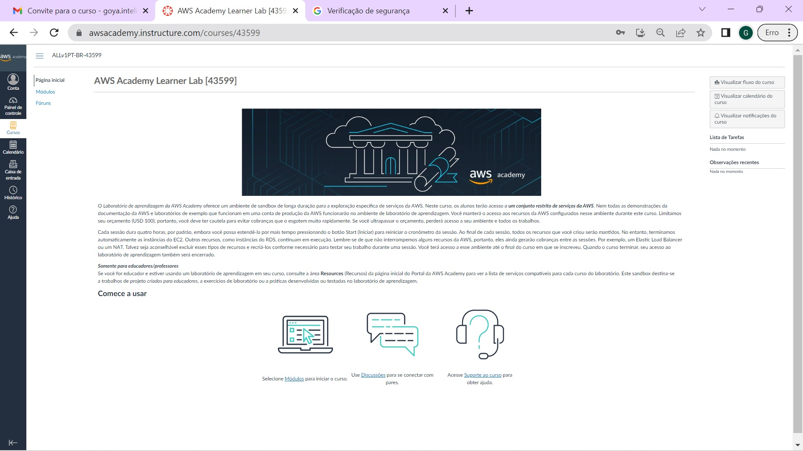
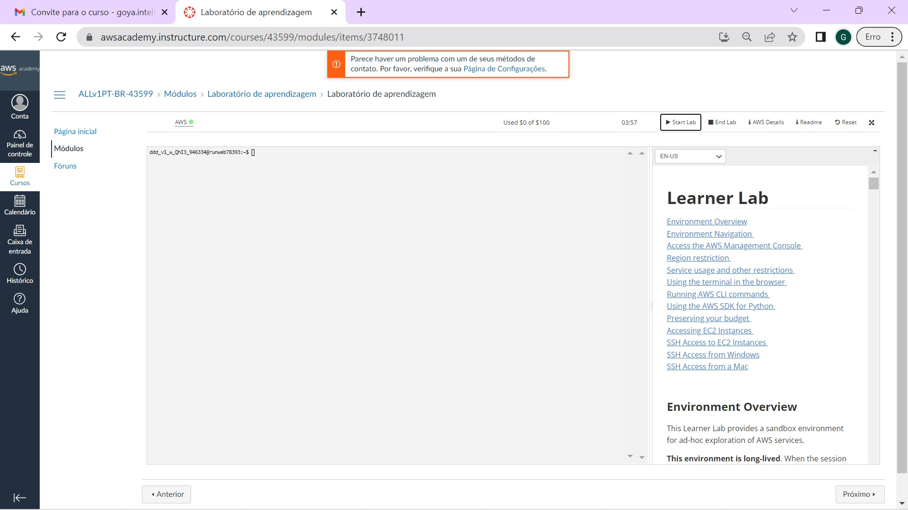

# Grupo-5
<table>
<td><a href= "https://www.inteli.edu.br/"></a>
</td>
</tr>
</table>

# Introdução


Projeto realizado em parceria com a <a link="https://www.stone.com.br/">Stone</a> visando criar uma aplicação em núvem escalável e com alta disponibilidade, buscando maximizar a resiliencia da plataforma, para que a aplicação seja capaz de enfrentar picos expressivos de demanda.

Para este projeto, estruturamos uma infraestrurua com base nos servidores da AWS, utilizando ao máximo dos recursos disponibilizados pela Amazon, permitindo que nossa aplicação se adapte aos diferentes níveis de carga, por meio de um redimensionamento do consumo de recursos, tornando-a assim, mais sustentável.

# Projeto: *Aplicação Escalável em Sistemas Distribuídos*

# Grupo: *Grupo 1*

# Integrantes:

* [Iago Medeiros Tavares](mailto:iago.tavares@sou.inteli.edu.br)
* [João Pedro Sartori Garcia de Alcaraz](mailto:joao.alcaraz@sou.inteli.edu.br)
* [Leandro de Oliveira Custódio](mailto:leandro.custodio@sou.inteli.edu.br)
* [Luiz Francisco Granville Gonçalves](mailto:luiz.granville@sou.inteli.edu.br)
* [Mateus Rafael Miranda da Silva](mailto:mateus.silva@sou.inteli.edu.br)
* [Melyssa de Souza Gonzales Rojas](mailto:melyssa.rojas@sou.inteli.edu.br)
* [Moisés Cazé](mailto:moises.caze@sou.inteli.edu.br)
* [Renato Silva Machado](mailto:renato.machado@sou.inteli.edu.br)

# Descrição

Descrição de um a dois parágrafos do projeto para um público-alvo tecnicamente leigo.

# Documentação

Os arquivos da documentação deste projeto estão na pasta [docs/index.md](docs/index.md), e o seu conteúdo é publicado via GitHub Pages.

# Artigo

O artigo escrito com base neste projeto pode ser lido no diretório [artigo/artigo.md](artigo/artigo.md)

# Configurações para desenvolvimento:

## Backend
1. **Configurar variáveis no backend de conexão com o banco** 
    Há dois arquivos de conexão: 
     - ``backend/src/config/config.json`` - os campos host e password devem ser alterados 
     - ````backend/.env```` - nele os campos nodemailer podem ser ignorados por enquanto.
2. **Rodar o migrations**
    Entrar na pasta src e rodar o comando ````sequelize db:migrate ````

## Frontend
No frontend, só é necessário mudar o arquivo ```src/config/config.ts```, colocando a rota do backend no lugar da variável ```API_URL```

## Ativação da conta na AWS Academy

O desenvolvimento do projeto na AWS utiliza o Learner Lab (Laboratório de Aprendizado). Para isso, o aluno precisa se cadastrar.
1. O procedimento começa recebendo um email com o convite (o nome e o email será o seu, não o do Goya como na figura e o número da turma entre '[]' será diferente do de onde foi copiado e colado...):<p><p>
2. Ao se aceitar o convite, entra-se no site de cadastro (O número entre '[]' é o número da sua turma no curso e não é exatamente o mesmo da figura):<p><p>
3. O cadastro registra uma senha, zona de tempo e um email de recuperação:<p><p>
4. Aceita os termos de serviço e se Registra:<p><p>
5. Pronto! Entra-se no site da AWS Academy:<p><p>
6. Para usar o console da AWS, selecione a opção:<p><p>
7. Aceita os termos de serviço:<p><p>
8. Na interface do laboratórios, selecione a opção Start Lab:<p><p>
9. Aguarde o sinal ao lado do AWS ficar verde:<p><p>
10. Então clique no círculo verde ao lado do AWS:<p><p>
11. Pronto, estamos no console da AWS:<p><p>


Para sair, pode-se terminar a sessão do laboratório e, depois, ir para Conta>Sair.

Para se retornar ao AWS Academy, deve-se fazer o login como estudante no:
[site da AWS Academy](https://www.awsacademy.com/vforcesite/LMS_Login)

# Tags

- Sprint 1
    - MVP com deploy da aplicação com arquitetura básica
    - Entendimento de Negócio
    - Requisitos Funcionais e Não Funcionais
    - Entendimento do Usuário

- Sprint 2
    - Arquitetura corporativa
    - Aplicação "Front-end e Back-end"
    - Artigo (versão 1)

- Sprint 3
    - Modelagem e Implementação
    - Artigo (versão 2)

- Sprint 4
    - Testes do sistema "Testes de integração, Testes de Microsserviços e Testes Unitários"
    - Definição da aplicação "Conteiner Docker, Kubernetes e Filas"
    - Artigo (versão 3)
    - Relatório Técnico

- Sprint 5
    - Apresentação da sprint final
    - Refinamentos da aplicação
    - Artigo completo
    - Análise de Gestão de Custo

# Licença
<table>
  <tr></tr>
</table>
<table>
  <tr></tr>
</table>
[Application 4.0 International](https://creativecommons.org/licenses/by/4.0/?ref=chooser-v1)