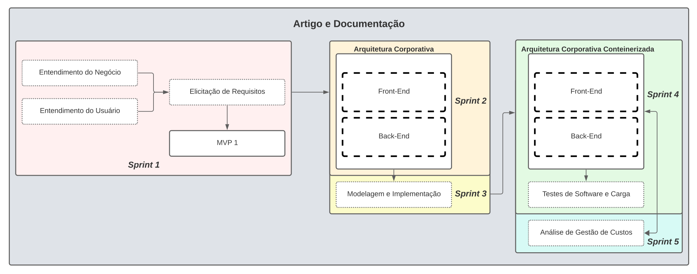

# Introdução

O contínuo avanço da tecnologia tem remodelado os cenários empresariais, incentivando as organizações a explorarem soluções inovadoras para enfrentar os desafios do mercado atual. Em um ambiente onde a agilidade tecnológica, a capacidade de desenvolver sistemas altamente eficientes e escaláveis tornou-se uma prioridade para atender às crescentes demandas e expectativas dos clientes (ZAMBALDI, 2016).

Em uma era onde o tráfego em aplicações está crescendo exponencialmente, a capacidade de um sistema de lidar com um grande número de acessos simultâneos sem comprometer a experiência do usuário tornou-se um diferencial competitivo significativo. Uma aplicação escalável é aquela projetada para expandir de maneira eficiente à medida que mais usuários ou demandas são incorporados. Isso significa que o sistema é capaz de enfrentar aumentos na carga de trabalho sem prejudicar o desempenho, permitindo expansões tanto horizontais, através da adição de mais recursos, quanto verticais, aprimorando os recursos existentes conforme necessário (AKSHLLEY, 2022), tudo isso mantendo a qualidade do serviço oferecido.

Nesse contexto, a Stone Pagamentos S.A, uma proeminente empresa de tecnologia financeira com atuação no mercado de adquirência, está tomando medidas proativas para enfrentar um desafio específico: a demanda durante as inserções publicitárias durante o programa "Big Brother Brasil".

Para a realização deste trabalho, foi estudado o serviço Amazon Web Services (AWS) e utilizado uma série de serviços interconectados para, assim, conseguir desenvolver uma aplicação altamente escalável que atenda a demanda do projeto.

Este artigo explora em detalhes o projeto de infraestrutura proposto pela Stone Pagamentos. Ao longo das próximas seções, serão detalhados os componentes principais do projeto, desde a implementação da aplicação web altamente escalável até a criação de um sistema de testes robusto para avaliar a disponibilidade e o desempenho.

# Trabalhos Relacionados

Para desenvolver este projeto, é necessário abordar pontos de extrema importância para garantir o sucesso, como a escalabilidade, a computação em nuvem, a segurança, a aplicação e sistemas distribuídos. Ziyad et al. (2021) explicaram sobre escalabilidade e infraestrutura em seu trabalho, dizendo que um aspecto relevante a ser levado em consideração é a ênfase em escalabilidade, uma vez que quase todos os setores, como pequenas e médias empresas, em diversos setores de atividade, se viram forçados a converter seus serviços para a computação em nuvem. Atividades como aulas, palestras, seminários, apresentações e até formaturas no período de pandemia se tornaram dependentes de um bom fluxo e de uma infraestrutura que atendesse altas demandas para atender todos os seus consumidores com qualidade. Este é um aspecto que nos traz a referência de que o aprendizado presencial e o aprendizado virtual estão com qualidades iguais ou muito similares nos tempos atuais, uma vez que até para criar e utilizar uma infraestrutura em nuvem, é oferecido um meio de ensino e treinamento pela fornecedora, ao qual é ministrado completamente online e com alta estrutura e qualidade.

Dois fatores muito importantes que merecem destaque são o pagamento sob demanda e a computação em nuvem, que traz às empresas uma possibilidade de redução de custos e tira a necessidade de espaço físico para alocar uma infraestrutura de equipamentos. Sem essa necessidade, as empresas podem se alocar em um escritório menor, dependendo de seu porte e número de colaboradores e, ainda assim, manter uma infraestrutura de software de alto potencial para atender os consumidores de seus serviços, com um custo relativamente baixo quando comparado com uma infraestrutura física e uma alocação de espaço necessário para comportá-la. Tal fator em conjunto com uma boa estrutura de segurança dentro da infraestrutura lógica do sistema, bem como com a economia financeira para a quantidade de ferramentas e recursos disponibilizadas para a empresa contratante, torna todo o custodio mais eficiente. Uma pesquisa realizada pelo IDC (International Data Corporation) com 244 executivos da área de TI, investigou qual o fator mais preocupante quanto ao uso da computação em nuvem e chegaram ao resultado de que 74,5% dos entrevistados têm como maior preocupação, o fator segurança (VELTE A., VELTE T. e ELSENPETER, 2010).

Segundo Vinoth et al. (2021) "Devido à sensibilidade da arquitetura de computação em nuvem, surgiram certos problemas de segurança. Como resultado, riscos e vulnerabilidades de segurança únicos precisam ser identificados com urgência por meio da avaliação de redes em nuvem. Ou seja, uma avaliação de vulnerabilidades e ataques, bem como a identificação de soluções adequadas para melhorar a segurança e a privacidade no ambiente de nuvem são necessárias para a implementação em larga escala da Computação em Nuvem.". O que conecta-se a um ponto relevante que será comentado futuramente neste mesmo artigo, que é o quanto cada área está se preparando para migrar e se tornar expert no uso da computação em nuvem.

Quando fala-se sobre aplicação e sistemas distribuídos e direciona-se este tema às empresas de comércio atacadista e varejista há alguns anos, é notório o quanto houve resistência para a adoção e migração dos sistemas das empresas para a computação em nuvem. O aumento só foi perceptível em 2018 e só tornou-se exponencial durante a pandemia de COVID-19. Ao perceber que os estabelecimentos não podiam mais atender e que precisariam fazê-lo à distância, os comércios de atacado e varejo notaram que, com uma boa infraestrutura, poderiam tornar o atendimento virtual e, em alguns casos, até híbrido, como é o caso das maiores varejistas do nosso país.

Embora muito ampla e muito adaptável ao uso de cada setor, há, no momento, um grande problema dentro da computação em nuvem (além da segurança), que é a dificuldade em encontrar projetos similares quando se está começando uma nova empresa e se precisa de um norte ou mesmo quando se tem uma infraestrutura física e busca-se migrar para a nuvem. Isto é o que diz o Dr. Amit Sharma, da Career Point University. Segundo ele, devido à sensibilidade da arquitetura de computação em nuvem, surgiram vários problemas de segurança e, como resultado disto, riscos e vulnerabilidades únicas de segurança precisam ser identificados com urgência pelos métodos de avaliação de redes em nuvem. Ou seja, uma avaliação de vulnerabilidades e ataques, bem como identificação de soluções adequadas para melhorar a segurança e a privacidade dos ambientes em larga escala são necessárias para a implementação de escala da Computação em Nuvem. (SHARMA, Dr. Amit, 2022).

Contudo, embora haja uma infraestrutura robusta e inúmeras oportunidades a serem aproveitadas na computação em nuvem, é essencial manter um foco constante na segurança e na identificação de vulnerabilidades no sistema. Vê-se o desafio em planejar em detalhes a fim de garantir que a aplicação seja segura, escalável, bem distribuída e com o mínimo aspecto de vulnerabilidade. Sendo assim, durante o desenvolvimento da aplicação, serão realizados testes para avaliar cada aspecto mencionado, com o intuito de garantir que a Stone Pagamentos S.A tenha um MVP da aplicação confiável e garantir também o entendimento de como e porquê cada ponto foi trabalhado de sua devida forma, uma vez que o projeto visa o aprendizado.

## Materiais e Métodos

Este estudo está alinhado com as tendências em constante evolução no mercado de software, centrando-se na busca por atributos tangíveis que são proporcionados pela ampla adoção da infraestrutura em nuvem. Esta tendência tem sido observada em diversos produtos em várias indústrias, conforme discutido detalhadamente no capítulo anterior (MORENO-VOZMEDIANO, 2012).

O desenvolvimento do protótipo foi concebido com base no contexto fornecido pela Stone Pagamentos S.A., com especial atenção ao fato de que o site mais acessado pelos usuários durante o reality show "Big Brother Brasil" é aquele que oferece produtos e serviços da Ton, um subproduto da Stone direcionado a empreendedores autônomos. Portanto, o Minimum Viable Product (MVP) (LENARDUZZI, 2016) é uma aplicação web meticulosamente projetada para emular, de forma abrangente, a solução de vendas e oferta de produtos da Ton (FIGUEIREDO, 2020). O protótipo foi elaborado para permitir a emulação de uma variedade de cenários do sistema real, visando a avaliação de atributos críticos, tais como resiliência, disponibilidade, escalabilidade, elasticidade, entre outros.

O MVP foi desenvolvido por um grupo de oito desenvolvedores utilizando a metodologia ágil Scrum (FOWLER, 2019). O projeto foi dividido em cinco entregas, conforme apresentado na Figura 1. Cada uma das entregas teve duração de duas semanas. Para facilitar a compreensão dos materiais e métodos empregados, esta seção foi organizada em uma linha do tempo correspondente às cinco sprints. Em cada sprint, são detalhadas as entregas realizadas para agregar valor ao cliente e contribuir para o resultado final.

Imagem 1: Processo Metodológico

### Sprint 1

Durante as primeiras duas semanas, a equipe de desenvolvimento tinha como principal objetivo compreender a solicitação do cliente, identificar os requisitos funcionais e não funcionais da solução final e testar um protótipo completo implantado em um serviço de nuvem (GLINZ, 2005). Essa etapa foi essencial para o aprendizado da equipe e para alinhar seus conhecimentos.

#### Entendimento do Negócio e do Usuário

Na primeira semana, a equipe concentrou-se na análise do contexto do negócio do cliente, da indústria em questão e do problema a ser resolvido, especialmente relacionado a uma solução baseada em arquitetura de nuvem. Além disso, buscaram uma compreensão mais profunda do usuário da solução final, visando projetar a solução de forma otimizada, considerando as regras de negócios e as necessidades do usuário. Para isso, foram aplicados métodos analíticos reconhecidos na área de administração de negócios, como o Value Proposition Canvas (POKORNÁ, 2015), a Matriz de Avaliação de Valor Oceano Azul (KIM, 2017), a Matriz de Risco (DUIJM, 2015), a Análise Financeira do Projeto (MARESOVA, 2017) e técnicas de experiência do usuário, como Pesquisa Quali-quantitativa (MUNK, 2019), Narrativa da História (MICHAILIDOU, 2013) e definição de Atores-Usuários(Personas) (CHANG, 2008).

#### Elicitação de Requisitos Funcionais e Não Funcionais

Após concluir a etapa anterior e realizar uma reunião de alinhamento com o cliente, tornou-se evidente quais requisitos seriam indispensáveis para que a aplicação alcançasse o critério de "pronto" ao término das 10 semanas de desenvolvimento. Nesse contexto, foram identificados os requisitos funcionais, relacionados às funcionalidades visíveis e vivenciadas pelo usuário, bem como os requisitos não funcionais, que dizem respeito às características e desempenho não diretamente perceptíveis ao usuário, mas que desempenham um papel crucial, especialmente em um projeto baseado na tecnologia de nuvem.

#### Prototipação de Uma Solução Teste

Para a primeira entrega ao cliente, foi projetada e implementada uma solução web simples e integrada. Essa solução serviu como exemplo de um sistema CRUD (TRUICA, 2015) completo implantado na arquitetura de nuvem, utilizando os serviços da AWS (MATHEW, 2014).

### Sprint 2

Durante a segunda sprint, houve um avanço guiado pelos resultados e feedbacks coletados na sprint anterior. Iniciou-se o processo de design e desenvolvimento da aplicação, que posteriormente seria implantada na AWS (Amazon Web Services). Foram abordados diversos aspectos, incluindo o desenvolvimento do front-end, back-end e a arquitetura corporativa em nuvem dos componentes (BEJJU, 2014), todos cuidadosamente alinhados com os requisitos previamente levantados e validados.

#### Front-End

A camada visual da aplicação, também conhecida como front-end, foi concebida por meio da utilização da ferramenta Figma (STAIANO, 2022), que permitiu a prototipagem estática da solução. Com base nesse projeto, o time desenvolveu as telas da aplicação web, empregando uma série de tecnologias, dependências e um gerenciador de pacotes específico. Para essa finalidade, foram escolhidas as seguintes tecnologias: 
* Vite (VITE, 2023)
* React-Native (REACT, 2023)
* TypeScript (MICROSOFT, 2023)
* Npm (GITHUB, 2023)

#### Back-End

A camada lógica da aplicação, conhecida como back-end, é responsável pela implementação das regras de negócio. Nessa etapa, foi desenvolvida essa parte da aplicação para permitir o fluxo completo do usuário por meio das APIs. Isso incluiu a modelagem do banco de dados, que foi implementada no PostgreSQL(POSTGRESQL, 2023), utilizando uma instância do RDS, o serviço de banco de dados relacional da AWS (MATHEW, 2014). Além disso, o back-end foi estruturado seguindo o modelo MVC (Model-View-Controller) (LUCIANO, 2017), usando a linguagem TypeScript e suportado pelo ambiente Node.js (GOOGLE, 2023).

#### Arquitetura Corporativa

Na fase inicial da implementação da infraestrutura na nuvem AWS, foram priorizadas a modelagem e implementação com foco nos requisitos do sistema e nas necessidades do cliente. A arquitetura principal consiste em uma Virtual Private Cloud (VPC) com duas zonas de disponibilidade, cada uma com uma subnet pública e uma subnet privada. A subnet pública da zona de disponibilidade principal inclui um Bastion Host, servidores front-end, um NAT Gateway e um Elastic Load Balancer (ELB) para escalabilidade e balanceamento de carga.

Na subnet privada, há um Auto Scaling para adicionar servidores conforme necessário, além de um banco de dados Relational Database Service (RDS). Fora da VPC, há um Internet Gateway para permitir comunicação da subnet pública com a internet, e também são usados o Amazon S3 para armazenamento de snapshots e o Amazon CloudFront para melhorar o desempenho.

Todos os componentes na VPC têm regras de acesso por meio de grupos de segurança para controlar protocolos e endereços de IP. Isso inclui grupos de segurança para o Bastion, front-end, back-end e banco de dados. 

### Sprint 3

A terceira sprint concentrou-se na validação e melhoria dos resultados obtidos até o momento. O principal objetivo foi concluir o MVP (Minimum Viable Product) ao abordar os requisitos restantes que não foram implementados na sprint anterior. Além disso, foram incorporadas as mudanças e insights fornecidos pelo parceiro do projeto por meio de feedbacks. Nessa fase, também foi dedicado esforço à modelagem do sistema em vários níveis, utilizando a linguagem UML (Unified Modeling Language) (MEDVIDOVIC, 2002).

#### MVP Versão 2

No MVP refatorado, foram introduzidas novas implementações de fluxos previamente mapeados, como uma versão aprimorada do fluxo de cadastro, a adição da funcionalidade "Esqueci Minha Senha", a capacidade de rastreamento de pedidos e alterações no fluxo de compra, que agora se concentra apenas em planos e dispositivos. Essas melhorias foram diretamente influenciadas pelas recomendações do parceiro, compartilhadas durante a última revisão da sprint. Além disso, no âmbito da infraestrutura, foi automatizada a criação e gerenciamento de recursos por meio da abordagem IaC (Infrastructure as Code) (RAHMAN, 2019), que permite manipular recursos da AWS de maneira eficaz e escalável por meio de formatos compactos como YAML ou JSON.

#### Modelagem e Implementação (Diagramas)

A etapa de modelagem e implementação envolveu a criação de quatro tipos de diagramas, cada um em um nível diferente de abstração e visualização. Estes incluem o diagrama de casos de uso, o diagrama de sequência UML, o diagrama de classes UML e o diagrama de implantação UML. Esses diagramas têm como objetivo documentar minuciosamente o software, proporcionando uma base sólida para as futuras etapas de atualização, expansão e teste, que serão fundamentadas na arquitetura de software implementada.

### Sprint 4

Na quarta sprint, os esforços foram direcionados para o aprimoramento e documentação dos microsserviços recentemente desenvolvidos, com foco na melhoria dos aspectos relacionados à qualidade do código e à modularização. Essas atividades desempenharam um papel crucial na asseguração de que a última iteração da infraestrutura, implantada durante este período, pudesse aproveitar plenamente a tecnologia de contêineres (PAHL, 2017).

Tecnologia de contêineres é uma abordagem de empacotamento de aplicativos que permite que um aplicativo e suas dependências sejam encapsulados em um ambiente isolado e portátil chamado de contêiner. Esses contêineres podem ser implantados de forma consistente em diferentes ambientes, como servidores locais, data centers ou serviços de nuvem (PAHL, 2017). No contexto específico deste projeto, a tecnologia de contêineres foi usada para criar ambientes isolados e eficientes para as diferentes partes da aplicação. Isso facilita a implantação, escalabilidade e gerenciamento dos componentes do aplicativo, garantindo que eles funcionem de maneira confiável em qualquer ambiente. O uso de contêineres também simplifica a distribuição e atualização do software, tornando-o uma escolha popular para implantações em nuvem e desenvolvimento de microsserviços (PAHL, 2017).

Além disso, visando assegurar a qualidade do software, foram realizados o mapeamento, o design e os testes de casos abrangendo testes unitários, de integração e de microsserviços.

#### MVP Versão 3 em Contêineres

O MVP passou por adaptações significativas para garantir uma arquitetura sólida. Os desenvolvedores finalizaram a documentação do código e aderiram rigorosamente às convenções de qualidade de código. Além disso, integraram e aprimoraram os recursos que ainda estavam pendentes dentro do escopo definido pelo cliente. Nesse contexto, a equipe implementou uma arquitetura baseada em microsserviços contêinerizados, com o objetivo de alcançar um processamento mais eficiente e controlado, proporcionando maior disponibilidade aos usuários do sistema. Para isso, foram utilizadas tecnologias como AWS EKS e AWS ECR para a implementação do Kubernetes na arquitetura, juntamente com os devidos registros dos contêineres (PONISZEWSKA-MARAŃDA, 2021).

#### Relatório Técnico e Testes

Nesta sprint, o foco se voltou para a integridade do software, avaliando o quão bem ele opera sem erros e garantindo a conformidade com os requisitos não funcionais do sistema. Para validar o desempenho adequado, a equipe desenhou uma série de testes que abrangiam os casos de uso previamente mapeados, abordando diferentes níveis de complexidade, incluindo testes unitários, de integração e de microsserviços. Além disso, para avaliar os requisitos não funcionais de disponibilidade e resiliência exigidos pelo cliente, a equipe utilizou a ferramenta K6 (K6, 2023) e analisou os resultados por meio do Grafana (GRAFANA, 2023) .

### Sprint 5

A quinta sprint está voltada para a conclusão e ajustes finais do protótipo, que foi validado pela última vez na sprint anterior. Neste estágio, foi realizada uma ampla refatoração de todo o projeto, garantindo a documentação abrangente de todas as partes, incluindo padrões de código e critérios de qualidade de software. Além disso, foi gerado um relatório detalhado com uma análise de gestão de custos dos recursos utilizados na AWS, comparando as três diferentes arquiteturas desenvolvidas ao longo do projeto. Este relatório é enriquecido com gráficos e tabelas que proporcionam uma análise abrangente e justificam a escolha da melhor arquitetura, considerando as necessidades e restrições do cliente (MISHRA, 2023).

#### MVP Versão 4 em Contêineres

A equipe de desenvolvimento concentrou seus esforços nos ajustes finais da aplicação, do código e na documentação do sistema, desenvolvido com a infraestrutura baseada em Kubernetes para a Stone Pagamentos S.A. Durante esta fase, todos os aspectos, como modularidade, nomenclatura, implantação, controle de versão, integridade e correção, foram minuciosamente revisados para garantir a entrega final do protótipo em sua melhor forma.

#### Análise de Gestão de Custos

Além das análises de aspectos de negócio, experiência do usuário e interatividade, a equipe dedicou os últimos momentos para realizar uma análise detalhada dos custos associados às arquiteturas desenvolvidas ao longo das sprints. O objetivo era fornecer informações precisas que contribuíssem para a gestão e tomada de decisão em relação à escolha da solução mais adequada, considerando as necessidades e restrições do negócio. Para essa análise, utilizamos principalmente a Cost Calculator da AWS (MISHRA, 2023), uma ferramenta que calcula os custos em cenários hipotéticos com base no uso passado da arquitetura em questão, oferecendo uma visão clara dos custos envolvidos.

# Resultados Obtidos
Através dos testes realizados, notou-se que a aplicação monolítica estruturada não seria tão compensatória em uma relação custo-benefício, pois mesmo que atendesse a demanda de requisições trazida pelos parceiros de projeto, teria um custo muito elevado quando colocada em produção. Sendo assim, foi tomada a decisão de migrar os serviços de uma aplicação só para a aplicação em microsserviços e realizar novos testes, verificando assim, se essa opção se torna mais viável em processamento e em custo dentro dos recursos e serviços AWS.

Os resultados desses testes confirmaram que a transição para microsserviços foi acertada. A modularização proporcionada pelos microsserviços não apenas melhorou a eficiência operacional, mas também permitiu uma adaptação mais ágil às mudanças nas demandas do mercado. Além disso, a escalabilidade dos microsserviços se revelou fundamental para lidar com picos de tráfego sazonais, garantindo um desempenho consistente da loja online. Essas mudanças contribuíram significativamente para a otimização dos recursos e aprimoramento contínuo da experiência do usuário.

Aprimorar constantemente a usabilidade, segurança e confiabilidade do sistema é crucial para manter a satisfação dos clientes e assegurar o sucesso contínuo da loja online. À medida que novos recursos são incorporados e as exigências dos usuários evoluem, a realização de testes contínuos e a solicitação de feedback dos clientes tornam-se práticas fundamentais para garantir que o sistema continue a atender às expectativas do mercado.

Em resumo, os resultados confiáveis dos testes funcionais indicam que o sistema da loja online está pronto para proporcionar aos usuários uma experiência de compra online efetiva, com funcionalidades confiáveis e eficazes que atendem às suas necessidades e expectativas. Isso contribui para a construção de um site alinhado com os requisitos do projeto.

# Conclusão
Com base em todo o contexto e informações apresentados anteriormente neste artigo, pode-se concluir que o grupo desenvolveu-se de forma tanto individual quanto colaborativa para compreender e abodar o funcionamento de serviços e recursos AWS, bem como as regras de negócios e aplicações necessárias para desenvolver uma aplicação escalável e fucional em sistemas distribuídos. Com o conhecimento adquirido no processo, foi possível desenvolver uma aplicação MVP que simula uma loja de máquinas e terminais de pagamento da Stone. Através desta simulação, foi possível a construção de uma arquitetura que abrange aspectos fundamentais, como disponibilidade, escalabilidade, segurança e custo-benefício. Foi possível aprender também sobre modelos de teste e a importância de cada tipo de teste para uma aplicação ou sistema, entre outros aprendizados colaborativos e habilidades comportamentais que foram desenvolvidas ao longo do projeto.

No que diz respeito ao projeto em si, é importante ressaltar que a aplicação desenvolvida não atingiu a meta inicial de requisições acordada com nossa parceira de projeto, a Stone Pagamentos S.A. No entanto, é possível observar que outros objetivos, como segurança, custo-benefício, escalabilidade e disponibilidade, foram alcançados com êxito.

O Grupo Jade expressa sua sincera gratidão à Stone Pagamentos S.A. pela parceria e pelo projeto desafiador confiado à equipe. A disponibilidade contínua da empresa parceira e os feedbacks valiosos ao longo do projeto contribuíram significativamente para o desenvolvimento do grupo em diversos aspectos do conhecimento. Espera-se que o MVP desenvolvido possa continuar sendo um recurso útil para aprimorar as estruturas lógicas da Stone daqui em diante.
# Referências Bibliográficas

AKSHLLEY, Kewyn; CARVALHO, Marcus; LOPES, Raquel. Análise de desempenho de estratégias de autoscaling vertical e horizontal: um estudo de caso com o Kubernetes. In: Anais Estendidos do XL Simpósio Brasileiro de Redes de Computadores e Sistemas Distribuídos. SBC, 2022. p. 201-208.

AL-DHURAIBI, Yahya et al. Autonomic vertical elasticity of docker containers with elasticdocker. In: 2017 IEEE 10th international conference on cloud computing (CLOUD). IEEE, 2017. p. 472-479.

BEJJU, Anurag. Cloud computing for banking and investment services. Advances in Economics and Business Management, v. 1, n. 2, p. 34-40, 2014.

ALASHHAB, Ziyad R.; ANBAR, Mohammed; SINGH, Manmeet Mahinderjit Singh; LEAU, Yu-Beng; AL-SAI, Zaher Ali; ALHAYJA'A, Sami Abu. Impact of coronavirus pandemic crisis on technologies and cloud computing applications. v. 19, p. 4-5, 2021.

VELTE, Anthony T.; VELTE, Toby J.; ELSENPETER, Robert. Could Computing: computação em Nuvem – Uma Abordagem Pratica. Tradução de Gabriela Mei. Rio de Janeiro: Alta Books. 2010.

VINOTH, S.; VEMULA, Hari Leela; HARALAYYA, Bhadrappa; MAMGAIN, Pradeep; HASAN, Mohammed Faez; NAVED, Mohd. Application of cloud computing in banking and e-commerce and related security threats. v. 51, p. 2172-2715, 2022.

SHARMA, Dr. Amit. Implications of cloud computing on e-commerce in India. v. 3, p. 146, 2022.

CHANG, Yen-ning; LIM, Youn-kyung; STOLTERMAN, Erik. Personas: from theory to practices. In: Proceedings of the 5th Nordic conference on Human-computer interaction: building bridges. 2008. p. 439-442.

DUIJM, Nijs Jan. Recommendations on the use and design of risk matrices. Safety science, v. 76, p. 21-31, 2015.

FIGUEIREDO, José Augusto Lopes et al. Stone Pagamentos: armadilhas do crescimento exponencial. Administração: Ensino e Pesquisa, v. 21, n. 1, p. 114-145, 2020.

FOWLER, Frederik M.; FOWLER, Frederik M. What Is Scrum?. Navigating Hybrid Scrum Environments: Understanding the Essentials, Avoiding the Pitfalls, p. 3-8, 2019.

GITHUB. NPM Documentation. 2023. Disponível em: https://docs.npmjs.com/. Acesso em: 19 set. 2023.

GLINZ, Martin. Rethinking the notion of non-functional requirements. In: Proc. Third World Congress for Software Quality. 2005. p. 55-64.

GOOGLE. Node.js Documentation. 2023. Disponível em: https://nodejs.org/pt-br/docs. Acesso em: 19 set. 2023.

GRAFANA. Grafana Documentation. 2023. Disponível em: https://grafana.com/docs/grafana/latest/. Acesso em: 19 set. 2023.

K6. K6 Documentation. 2023. Disponível em: https://k6.io/docs/. Acesso em: 19 set. 2023.

KIM, W. Chan; MAUBORGNE, Renée A. Blue ocean leadership (Harvard business review classics). Harvard Business Review Press, 2017.

LENARDUZZI, Valentina; TAIBI, Davide. MVP explained: A systematic mapping study on the definitions of minimal viable product. In: 2016 42th Euromicro Conference on Software Engineering and Advanced Applications (SEAA). IEEE, 2016. p. 112-119.

LUCIANO, Josué; ALVES, Wallison Joel Barberá. Padrão de arquitetura MVC: Model-view-controller. EPeQ Fafibe, v. 1, n. 3a, p. 102-107, 2017.

MARESOVA, Petra; SOBESLAV, Vladimir; KREJCAR, Ondrej. Cost–benefit analysis–evaluation model of cloud computing deployment for use in companies. Applied Economics, v. 49, n. 6, p. 521-533, 2017.

MATHEW, Sajee; VARIA, J. Overview of amazon web services. Amazon Whitepapers, v. 105, p. 1-22, 2014.

MEDVIDOVIC, Nenad et al. Modeling software architectures in the unified modeling language. ACM Transactions on Software Engineering and Methodology (TOSEM), v. 11, n. 1, p. 2-57, 2002.

MICHAILIDOU, Ioanna; VON SAUCKEN, Constantin; LINDEMANN, Udo. How to create a user experience story. In: Design, User Experience, and Usability. Design Philosophy, Methods, and Tools: Second International Conference, DUXU 2013, Held as Part of HCI International 2013, Las Vegas, NV, USA, July 21-26, 2013, Proceedings, Part I 2. Springer Berlin Heidelberg, 2013. p. 554-563.

MICROSOFT. TypeScript Documentation. 2023. Disponível em: https://www.typescriptlang.org/pt/docs/. Acesso em: 19 set. 2023.

MISHRA, Pravin. AWS Billing and Pricing. In: Cloud Computing with AWS: Everything You Need to Know to be an AWS Cloud Practitioner. Berkeley, CA: Apress, 2023. p. 299-311.

MORENO-VOZMEDIANO, Rafael; MONTERO, Rubén S.; LLORENTE, Ignacio M. Iaas cloud architecture: From virtualized datacenters to federated cloud infrastructures. Computer, v. 45, n. 12, p. 65-72, 2012.

MUNK, Anders Kristian. Four styles of quali-quantitative analysis: Making sense of the new Nordic food movement on the web. Nordicom Review, v. 40, n. s1, p. 159-176, 2019.

PAHL, Claus et al. Cloud container technologies: a state-of-the-art review. IEEE Transactions on Cloud Computing, v. 7, n. 3, p. 677-692, 2017.

POKORNÁ, Jitka et al. Value proposition canvas: identification of pains, gains and customer jobs at farmers' markets. AGRIS on-line Papers in Economics and Informatics, v. 7, n. 665-2016-45080, p. 123-130, 2015.

PONISZEWSKA-MARAŃDA, Aneta; CZECHOWSKA, Ewa. Kubernetes cluster for automating software production environment. Sensors, v. 21, n. 5, p. 1910, 2021.

POSTGRESQL GLOBAL DEVELOPMENT GROUP. PostgreSQL Documentation. 2023. Disponível em: https://www.postgresql.org/docs/. Acesso em: 19 set. 2023.

RAHMAN, Akond; MAHDAVI-HEZAVEH, Rezvan; WILLIAMS, Laurie. A systematic mapping study of infrastructure as code research. Information and Software Technology, v. 108, p. 65-77, 2019.

REACT. React-Native Documentation. 2023. Disponível em: https://reactnative.dev/docs/getting-started. Acesso em: 19 set. 2023.

STAIANO, Fabio. Designing and Prototyping Interfaces with Figma: Learn essential UX/UI design principles by creating interactive prototypes for mobile, tablet, and desktop. Packt Publishing Ltd, 2022.

TRUICA, Ciprian-Octavian et al. Performance evaluation for CRUD operations in asynchronously replicated document oriented database. In: 2015 20th International Conference on Control Systems and Computer Science. IEEE, 2015. p. 191-196.

VITE. Vite Documentation. 2023. Disponível em: https://vitejs.dev/guide/why.html. Acesso em: 19 set. 2023.

ZAMBALDI, Leonardo Flores et al. Aplicação web escalável e customizável para sistema educacional. 2016.