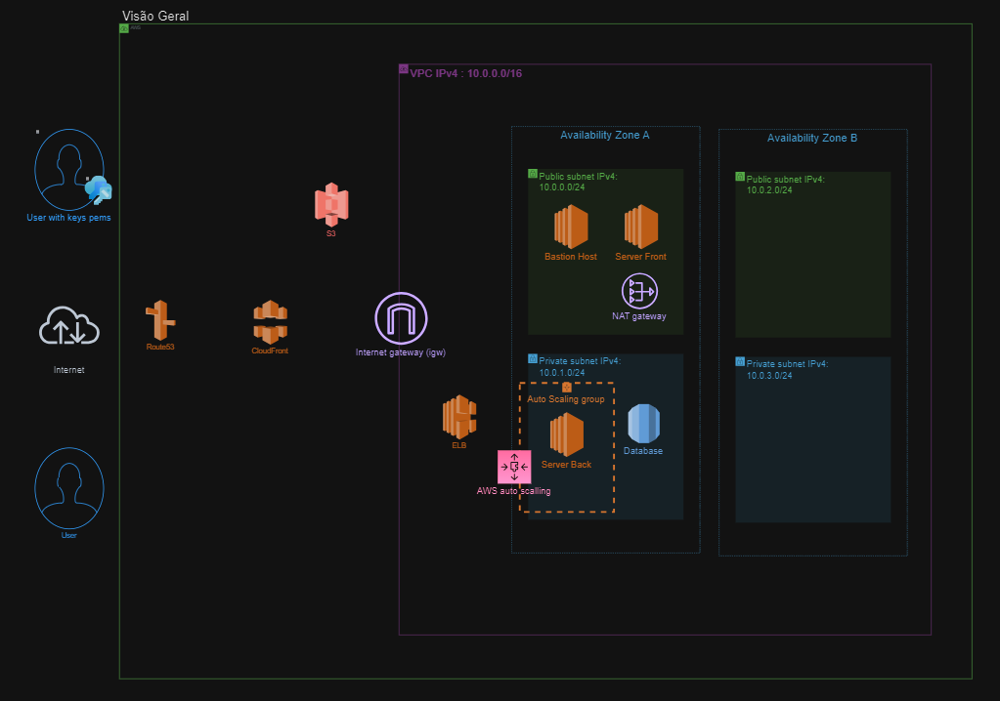
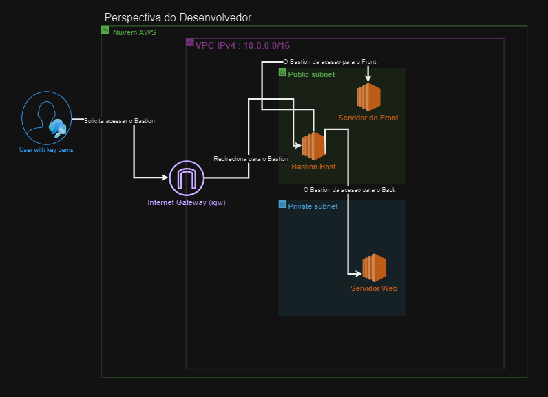
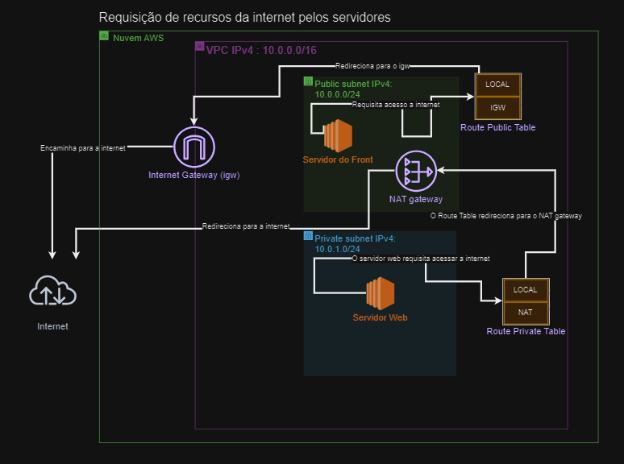
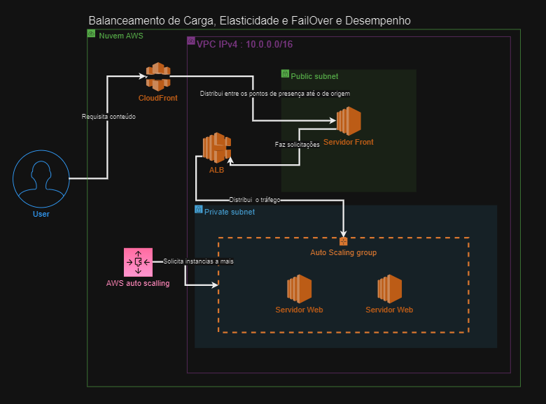
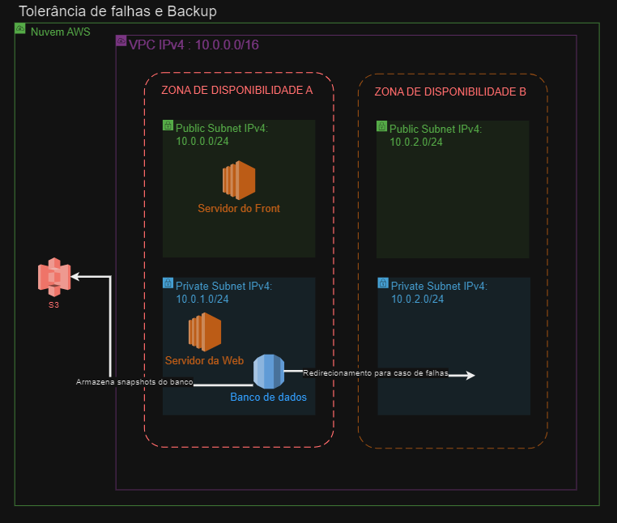
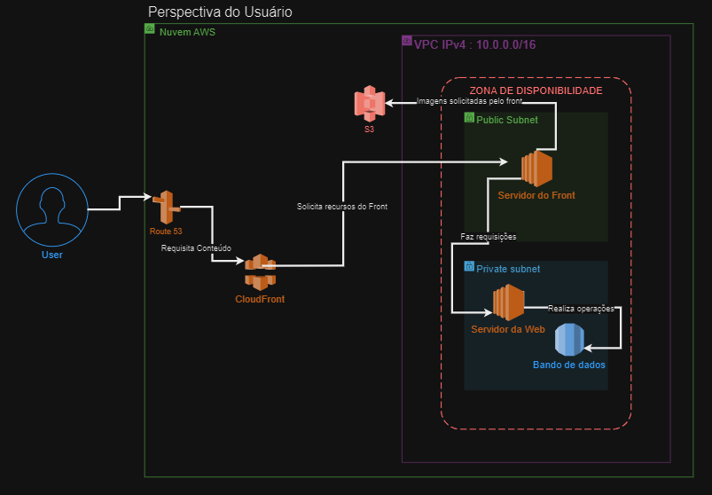

# Arquitetura Corporativa

A arquitetura do projeto foi fragmentada em cinco diagramas distintos. O inicial foi direcionado a visão do desenvolvedor, o segundo focado na busca de recursos pelos servidores, o terceiro foi focado na confiabilidade, o quarto abordando o sistema de alta disponibilidade e o quinto delineando a perspectiva abrangente do usuário.

## Visão Geral

## Perspectiva do Desenvolvedor 

O diagrama acima representa as instâncias públicas e privadas da aplicação para fins de configuração do sistema. Utilizando a chave PEM, o desenvolvedor obtém acesso à sub-rede pública dentro da Virtual Private Cloud (VPC), acessando-a através de um Internet Gateway. Posteriormente, ocorre um encaminhamento para o Bastion Host, que atua como uma camada de segurança, proporcionando pontos de ingresso tanto para o servidor do front, localizado na sub-rede pública, quanto para o servidor web, localizado na sub-rede privada.

## Requisição de recursos da internet pelos servidores 

O diagrama acima representa a interação entre os servidores da web/front-end e a internet. O fluxo de conexão entre os componentes começa com uma solicitação feita pela instância EC2 e a trajetória segue através das tabelas de roteamento para internet (IGW ou NAT) ou privada, ou seja IPs privados e nesse caso local que significa a comunicação de instâncias dentro de uma mesma VPC. Por fim, a rota do NAT encaminha o tráfego para o NAT Gateway, que tem a função primordial de possibilitar que instâncias em sub-redes privadas enviem pedidos para a Internet. Por outro lado, a tabela de rotas da sub-rede pública redireciona o tráfego para o Internet Gateway, permitindo que instâncias na VPC realizem comunicações unidirecionais com a Internet, ou seja solicitando recursos dela.

## Balanceamento de Carga, Elasticidade, Fail Over e Desempenho

O esquema acima ilustra a arquitetura que foi implementada para garantir o balanceamento de carga e a escalabilidade do projeto. Quando um usuário solicita um conteúdo, ele é direcionado para o CloudFront, que é uma Content Delivery Network (CDN) responsável por acelerar a entrega do conteúdo do servidor de origem, garantindo assim a baixa latência, e consequentemente o bom desempenho. A partir daí, o servidor do frontend inicia uma requisição ao backend, que está localizado na subnet privada. Esse processo é intermediado pelo Load Balancer, um componente responsável por distribuir as requisições dos clientes entre as instâncias do servidor web e roteiar o tráfego de uma instância para outra em casos de falha na primeira, e essas falhas são identificadas pelos testes feitos pelos grupos de destinos do load balancer.

A subnet privada é gerenciada por um grupo de Auto Scaling, que desempenha um papel crucial na garantia da elasticidade da aplicação. Esse grupo automatiza a gestão do número de instâncias do Amazon EC2 disponíveis para lidar com a carga de requisições. Dessa forma, a aplicação pode se expandir ou contrair dinamicamente, conforme necessário, para manter um desempenho adequado diante das flutuações da demanda.

Essa arquitetura assegura que a aplicação possa lidar eficazmente com diferentes volumes de tráfego, garantindo uma experiência consistente para os usuários e otimizando o uso dos recursos de infraestrutura.

## Tolerância a falhas e Backup

O diagrama acima representa a estrutura para tolerância a falhas e backup da aplicação. São criadas duas zonas de disponibilidade idêntidas dentro da VPC (zona de uso e a zona de redirecionamento). Através do serviço do S3 é possível realizar snapshots das instâncias de banco de dados. Em casos de falha na mesma infraestrutura ou um acontencimento de desastre, os snapshots armazenados no S3 são usados para a criação das instâncias necessárias para se usar na zona de redirecionamento, ou se caso for um desastre, haver a criação em outra região.
Por fim, é de grande importância apontar que o banco de dados tem escalabilidade vertical, ou seja, ele estica os recursos dentro de sua própria instância para atender a demanda.

## Perspectiva do Usuário

O diagrama acima representa a interação entre o usuário final e a aplicação. Quando uma solicitação é efetuada, o utilizador é encaminhado para o Route53 e depois CloudFront, por sua vez, acede à instância do front-end localizada na sub-rede pública e, por fim, o servidor do front-end estabelece ligação ao componente do servidor web situado na sub-rede privada que realiza operações referente ao banco de dados.