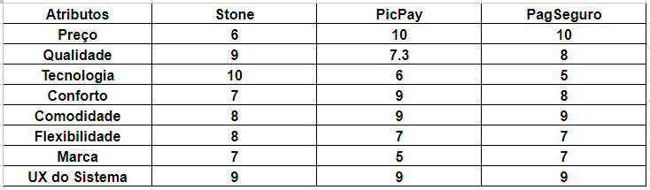
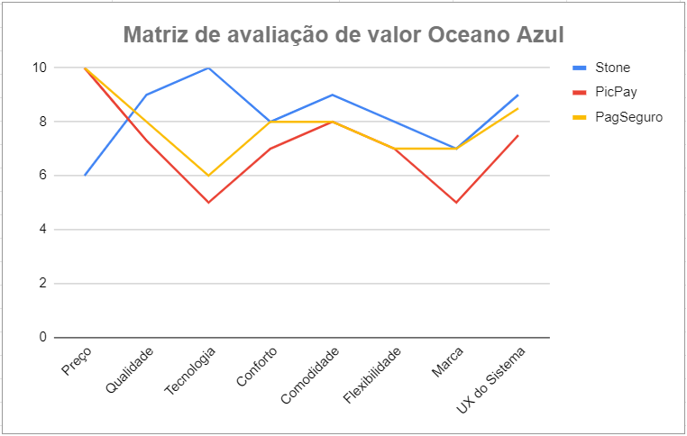
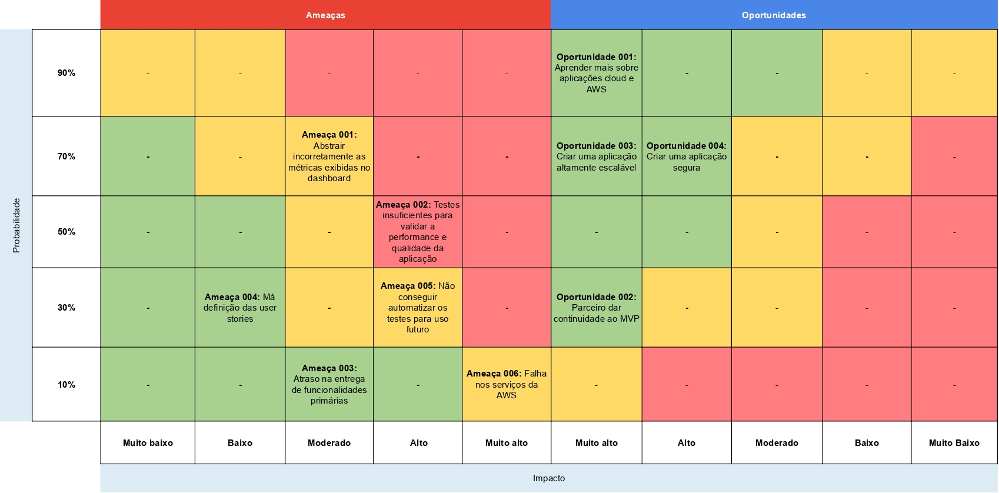
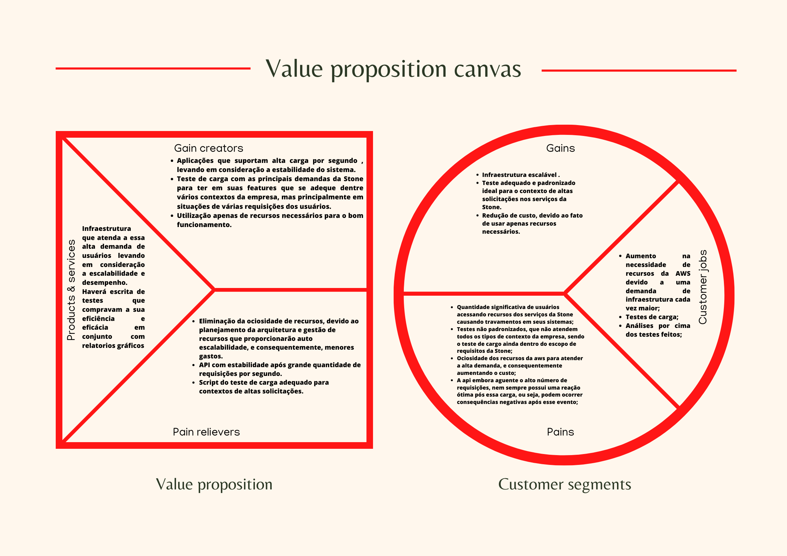
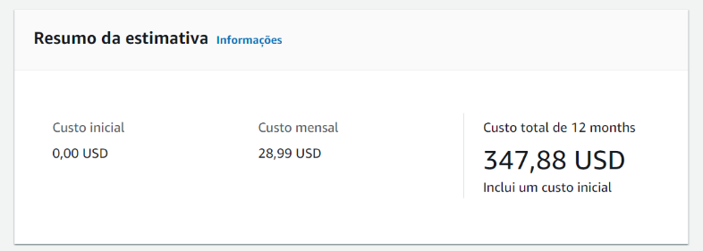

# Entendimento do Negócio
Na introdução de um indivíduo ou grupo de indivíduos em um projeto ou ao próprio mercado de trabalho, é necessário um tempo de adaptação, que pode ser conhecido como "período de adaptação" ou "período de entendimento". Neste período, é fornecida a estrutura necessária para que haja aprendizado e entendimento sobre o que será necessário para começar o desenvolvimento com base e qualidade.
Dentro do projeto atual, os grupos tiveram contato com alguns colaboradores da Stone para entender sobre a empresa, sua atuação e sobre como nos uniremos através de um projeto, ao qual colaboraremos durante dez semanas.
Na primeira etapa destas dez semanas, o grupo buscou aprender e entender sobre o negócio da empresa parceira e trouxeram algumas ferramentas que servirão de guia para, ao entendimento adquirido pelo grupo e validado com os colaboradores da empresa parceira, poderem desenvolver um protótipo de uso com qualidade e que atue de acordo com o planejamento em que foi desenvolvido para atuar.
A seguir, serão apresentadas as ferramentas de negócios que foram desenvolvidas:

## Matriz de Avaliação de Valor Oceano Azul
Esta ferramenta consiste em analisar o mercado em que uma empresa está inserida, quais são as suas principais concorrentes e, a partir de 4 ações (reduzir, eliminar, aumentar e criar), avaliar oportunidades de inovação e de trazer diferencial, o que a faz criar um novo mercado (chamado de oceano azul) e sair do mercado atual, que possui um grande número de concorrentes (chamado de oceano vermelho).
Pesquisando e aprendendo sobre a empresa e sua atuação, o grupo criou uma matriz de avaliação de oceano azul para a _Stone_. A seguir, você poderá ver uma análise com as seguintes informações: 8 atributos de comparação (Preço, Qualidade, Tecnologia, Conforto, Comodidade, Flexibilidade, Marca e UX do Sistema), 3 empresas concorrentes (Stone, PicPay e PagSeguro) e uma avaliação em escala de 0 a 10. Logo após a apresentação e explicação de cada atributo, você poderá ver um gráfico para compreensão visual da comparação entre as 3 empresas concorrentes e a conclusão que o grupo chegou referente a avaliação feita.
### Matriz Oceano Azul

A seguir, acompanhe a explicação sobre cada atributo; qual a ação que ele recebeu; e o motivo da nota recebida por cada uma das empresas:

### Preço
A avaliação de preço foi feita com base no site de cada empresa, analisando a quantidade de maquininhas e/ou maquinetas de cartão e seus respectivos valores. Com esta informação, as avaliações para este atributo foram: _Stone_ com nota 6 e _PicPay_ e _PagSeguro_ com nota 10, uma vez que a _Stone_ conseguiu reduzir os valores em relação às maquininhas e maquinetas das empresas concorrentes.

### Qualidade
No quesito qualidade, a avaliação levou em consideração as avaliações sobre a plataforma, suporte e sistema das maquininha dentro da plataforma de reportes "Reclame Aqui". As notas para as empresas foram: _Stone_ com nota 9, _PicPay_ com 7,3 e _PagSeguro_ com 8. Analisando o histórico das 3 empresas da plataforma "Reclame Aqui", nota-se que as notas das concorrentes subiram após o grande diferencial de atendimento da _Stone_ ser notado no segmento do mercado, podendo ser considerado um aumento no artibuto da avaliação.

### Tecnologia
A avaliação da tecnologia foi feita com base nos requisitos de segurança, conexão e conectividade, processamento de pagamento e outros aspectos de avaliação de eletrônicos, tais quais as máquinas de pagamento são parte, extraídos da entrevista feita com os parceiros de projeto. Neste atributo, as maquininhas e maquinetas ficaram com pontuações pouco distantes entre si, ressaltando a _Stone_, que recebeu uma nota elevada sobre as concorrentes comparadas. Dentro destes aspecto, as análises foram feitas pelas especificações técnicas de cada maquininha e maquineta e as notas foram: _Stone_ com nota 10, _PicPay_ com nota 5 e _PagSeguro_ com nota 6.

### Conforto
Dentro do atributo de conforto, foram levados em consideração, os fatores de facilidade e praticidade na contratação, abertura de conta e recebimento da(s) maquininha(s)/maquineta(s), quantos e quais meios de contato e o tempo médio entre o primeiro contato e o primeiro uso do terminal de pagamento. Neste aspecto, a _Stone_ tem um excelente tempo de atendimento e uma quantidade de canais de atendimento abrangente e um tempo de entrega muito eficiente. Em compensação, _PagSeguro_, por exemplo, atende lugares mais escassos do que as outras duas empresas mencionadas, eliminando gradativamente a exclusão de lugares menos populosos ou mais afastados das capitais de cada estado. Levando estas informações em consideração, o grupo avaliou cada empresa mencionada com as seguintes notas: _Stone_ e _PagSeguro_ empatam com nota 8 e _PicPay_ recebe nota 7.

### Comodidade
O atributo de comodidade foi avaliado sob o aspecto de facilidade e praticidade nos processos de atendimento para venda e nos processos de atendimento pós venda, como tempo de espera para atendimento, qualidade do atendimento, avaliação do cliente e sugestão de melhorias, entre outros aspectos. Neste atributo, a _Stone_ levou vantagem, uma vez que seu atendimento telefônico é feito em até 5 segundos e por suas maquininhas e maquinetas poderem chegar até o cliente dentro de 24 horas (dependendo do modelo e negociação). As notas dadas para este atributo, dentre as empresas comparadas foram: _Stone_ com 9 e _PicPay_ e _PagSeguro_ com 8.

### Flexibilidade
O atributo de flexibilidade foi avaliado com base nos processos entre a empresa e seu cliente, como avaliação de taxas por modelo ou tamanho do negócio. Neste atributo, a _Stone_ recebeu nota 8 e as empresas _PicPay_ e _PagSeguro_ receberam nota 7. Embora as notas sejam próximas entre as empresas, o fator e a opção de falar humanamente com o cliente e avaliar as taxas de acordo com o negócio e o uso da maquineta, torna a experiência do usuário melhor com a empresa e aumenta sua fidelidade e sua chance de recomendação.

### Marca
Quando falamos sobre marca, levamos em consideração alguns fatores que podem favorecer algumas empresas e desfavorecer outras. Um exemplo disso é usar a psicologia das cores para identificar um banco usando a cor verde. Neste caso, a _PicPay_ ainda tem maior número de respostas quanto à identificação. Quando o grupo fez esta avaliação, foi levada em consideração a análise de mercado quanto às empresas mencionadas. Neste aspecto, a _Stone_ e a _PagSeguro_ levam vantagem sobre a _PicPay_ por sua abrangência de mercado e por seus investimentos devido ao capital aberto, aumentando seus aspectos de marca e mercado. Tendo essas informações, as notas atribuídas neste tópico foram: _Stone_ e _PagSeguro_ com 7 e _PicPay_ com 5.

### UX do Sistema
Sobre o atributo da experiência do usuário com a maquininha, as três empresas da comparação estão novamente próximas. Para realizar esta comparação, o grupo levou em consideração novamente as informações da plataforma "Reclame Aqui", somada com avaliações dentro de seus respectivos sites. Com essa estrutura de informação, a _Stone_ recebeu nota 9 novamente, a _PicPay_ recebeu nota 7.5 e a _PagSeguro_ recebeu nota 8.5. Podemos ver um aumento neste aspecto, pois as empresas precisam se preocupar com a experiência, mas que a _Stone_ aumentou o aspecto e a experiência, quando comparada às empresas mencionadas na avaliação.

Com base na avaliação e em sua descrição previamente realizada. A seguir, é possível avaliar a comparação e seus atributos de forma visual, através de um gráfico de linhas.

Contudo, a avaliação rende o feedback de que a empresa _Stone_ encontrou oportunidades entre as maiores marcas de seu segmento e se direcionou diferentemente delas, aumentando, eliminando, reduzindo ou criando tecnologias ou inovações que diferenciasse sua marca dentro do mercado.

## Matriz de Risco

## Canvas Proposta de Valor
A imagem exibida abaixo descreve os principais pontos em relação ao entendimento do projeto, mas olhando pela perspectiva do que o projeto traria de relevância ao cliente provindo de suas features. 
Então, resumidamente, é visto que a principal dor do cliente a ser sanada seria suportar o alto número de requisições sem comprometer o sistema e sem ser ocioso. Partindo disso, a solução seria a construção de uma infraestrutura que permita uma escalibilidade e gestão de recursos eficiente, e claro, também considerando um monitoramento visual das principais métricas de performance.

## Análise Financeira do Projeto

Este documento corresponde ao que é solicitado no card "Entendimento de Negócio" na Sprint 1.

### Receita 

A proposta elaborada não possui uma fonte de receita direta, visto que se trata de um projeto focado em  campanhas de marketing. Para realizar a avaliação financeira detalhada, seria necessário obter acesso a informações altamente confidenciais da Stone, as quais não nos foram disponibilizadas.

### Orçamento total

Cada um dos membros que compõem o grupo dispõe de um saldo individual de 100 dólares em créditos na plataforma da AWS, somando assim um montante coletivo de 800 dólares destinado para utilização dentro da plataforma AWS. O orçamento foi disponibilizado para que a equipe consiga fazer testes reais dentro da plataforma.

### Custos

#### Métodos de pagamento

Existem 4 métodos de pagamento disponiveis na AWS (Compute Savings Plans, On demand, Spot Instances e EC2 Instance Savings Plans). No caso do projeto elaborado, por se tratar de um MVP, a melhor opção é o pagamento sob demanda porque ele oferece a flexibilidade necessária para ajustar os recursos de acordo com as necessidades variáveis do projeto em sua fase inicial. O pagamento sob demanda permite que você comece com uma base mínima de recursos e aumente gradualmente à medida que a demanda do MVP cresce.

O modelo de pagamento sob demanda é especialmente vantajoso quando se trabalha em um MVP, onde as estimativas iniciais de uso podem variar e evoluir rapidamente à medida que o projeto é refinado e desenvolvido. Não há necessidade de se comprometer com um contrato de longo prazo ou investir em recursos que possam não ser completamente utilizados no estágio inicial. Além disso, a abordagem de pagamento sob demanda alinha-se perfeitamente com os princípios ágeis e iterativos comuns na construção de um MVP.

No entanto, é importante monitorar de perto seus custos e considerar a transição para outras opções de pagamento, como Instâncias Reservadas ou Planos de Economia de Computação no caso de uso do projeto por parte da empresa. Essas opções podem proporcionar economias substanciais a longo prazo, à medida que você adquire mais previsibilidade em relação ao uso de recursos.

### Simulação de preço

Os custos de serviços de computação em nuvem da AWS são cobrados por hora/segundo, e os preços variam por instância. Foi feita uma estimativa de custo através de uma calculadora que é disponibilizada pelo site com os seguintes parâmetros:

*Sistema Operacional: Ubuntu*

*Carga de Trabalho: Pico de tráfego semanal*

*Instância: T3 micro*

*Pagamento: Sob demanda* 

# Canvas Proposta de Valor

A imagem exibida abaixo descreve os principais pontos em relação ao entendimento do projeto, mas olhando pela perspectiva do que o projeto traria de relevância ao cliente provindo de suas features. 
Então, resumidamente, é visto que a principal dor do cliente a ser sanada seria suportar o alto número de requisições sem comprometer o sistema e sem ser ocioso. Partindo disso, a solução seria a construção de uma infraestrutura que permita uma escalibilidade e gestão de recursos eficiente, e claro, também considerando um monitoramento visual das principais métricas de performance.

