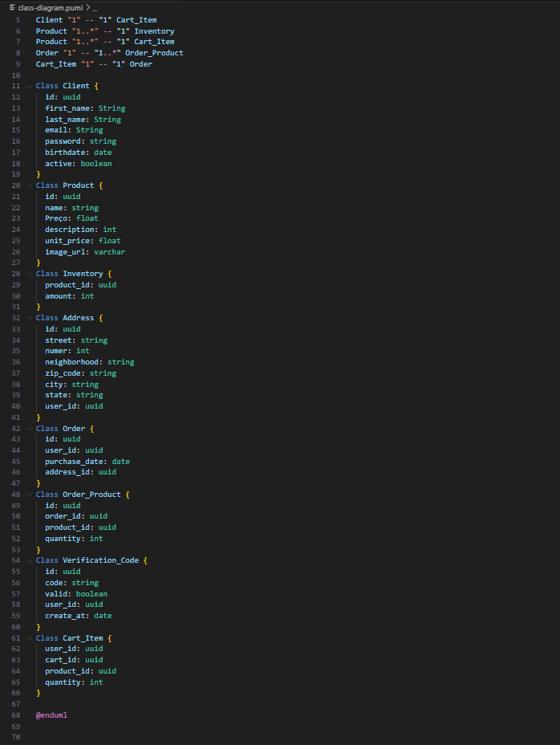

# Modelagem e Implementação

## Diagrama de Sequência
Um diagrama de sequência é um tipo de diagrama de interação usado na UML (Unified Modeling Language) para visualizar e descrever a interação entre objetos em um sistema de software ao longo do tempo. Eles são amplamente utilizados na modelagem de sistemas orientados a objetos e são especialmente úteis para representar o comportamento dinâmico de um sistema.

Os diagramas de sequência mostram como os vários objetos em um sistema interagem uns com os outros e como as mensagens são transmitidas entre eles durante um determinado cenário ou sequência de eventos. Eles são compostos por objetos (representados por retângulos) e linhas de vida (linhas verticais que representam a existência temporal de um objeto). As setas representam as mensagens trocadas entre os objetos e a ordem em que essas mensagens ocorrem é indicada pela posição vertical das setas no diagrama.

Descrição:

Browser: O browser é responsável pela forma do usuário acessar a interface da aplicação(Frontend).

Frontend: O frontend é responsável por exibir as informações da aplicação por meio de uma interface, como por exemplo formulários, lista de produtos e etc.

Backend: O backend é responsável por fazer os processamento das informações inseridas pelo usuário no frontend, e também realizar o envio dessas informações processadas.

Banco de dados: O banco de dados é responsável por armazenar essas informações que são processadas pelo backend, como por exemplo os cadastros de usuário e etc.

## Diagrama de Implantação

Um diagrama de implantação é um tipo de diagrama de estrutura usado na UML (Unified Modeling Language) para representar a disposição física dos componentes de um sistema de software em um ambiente de hardware ou rede. Esses diagramas são úteis para ilustrar como os diferentes elementos de um sistema estão distribuídos em servidores, computadores, dispositivos de rede e outros recursos de infraestrutura.

## Diagrama e descrições dos casos de uso
O diagrama de caso de uso é uma representação gráfica que fornece uma visão geral das interações entre os atores e os casos de uso dentro do escopo do sistema, ajudando a identificar as principais funcionalidades e como os usuários interagem com o sistema. Os principais componentes dele são:

- **Atores:** São representados por bonecos palito e representam as entidades externas que interagem com o sistema. Os atores podem ser pessoas, sistemas externos, ou qualquer entidade que execute os casos de uso. Por exemplo, um ator "Usuário" pode interagir com o caso de uso "Fazer login".

- **Caso de Uso:** Representado por uma forma oval na horizontal, os casos de uso indicam as diferentes ações ou funcionalidades que um usuário pode realizar no sistema. Cada oval representa um caso de uso específico, como "Fazer login" ou "Realizar compra".

- **Caixa de Limite do Sistema:** É uma caixa que envolve os casos de uso e atores, definindo o escopo do sistema. Esta caixa representa os limites do sistema em que os casos de uso e atores operam. Fora da caixa de limite do sistema, estão os elementos que estão fora do escopo do sistema.

- **Associações:** São linhas que conectam os atores aos casos de uso correspondentes. As associações mostram quais atores estão relacionados a quais casos de uso. Por exemplo, uma linha ligando o ator "Cliente" ao caso de uso "Realizar compra" indica que o cliente pode realizar compras no sistema.

Abaixo será descrito cada caso de uso aplicado ao projeto da Stone:

### Caso 1: Cadastrar Conta
**Nível:** Objetivo do usuário.
**Atores:** Usuário. 
**Interessados e interesses:** 
Empresa: Tem a intenção de expandir sua base de usuários como parte de sua estratégia para impulsionar o crescimento das vendas.

Usuário: Tem o interesse de se registrar na plataforma, com o objetivo de aproveitar suas diversas funcionalidades, como a possibilidade de adquirir uma maquininha para seu empreendimento.

**Pré-condições:** Não se aplica.
**Pós-condições:** Cadastro realizado com sucesso. 
**Fluxo Básico:** 
1. Usuário seleciona o botão "Crie uma conta" na página inicial ou em "Login com Google".
2. Usuário preenche o formulário de cadastro adicionando o nome, e-mail e senha.
3. Usuário clica no botão "Prosseguir".
4. Usuário preenche o formulário de inserindo a profissão.
5. Usuário clica no botão "Cadastar".
6. Cliente cadastrado.
 

**Fluxos alternativos:**  

1. Campo inválido

    1. Sistema notifica o erro e recusa o acesso.
    2. Usuário preenche novamente inserindo informações válidas.

2. Campo não preenchido

    1. Sistema notifica o erro e recusa o acesso.
    2. Usuário preenche todos os devidamente.

**Requisitos especiais:** 
- O cadastro deve poder ser feito via desktop e mobile

**Lista de variantes:**  Não se aplica
**Frequência de ocorrência:** Apenas na primeira interação do usuário com a plataforma. 

### Caso 2: Tirar dúvidas
**Nível:** Objetivo do usuário.
**Atores:** Usuário. 
**Interessados e interesses:**
- Usuário: Deseja entrar em contato com o suporte da Stone para tirar dúvidas.
- Empresa: Deseja atender o seu cliente em tempo real para promover melhor experiência.

**Pré-condições:** Usuário deve ter uma conta cadastrada no Site.
**Pós-condições:** Não se aplica. 
**Fluxo Básico:**  
1. Usuário insere suas informações e clica em "Login".
2. Usuário clica no icone de mensagem na Página Principal.
3. Usuário digita a mensagem e clica em enviar.

**Fluxos alternativos:**  
1. Usuário deseja cancelar a ação de enviar mensagem.

    1. Usuário clica no "X" no canto superior direito do modal.
    2. Modal é fechado e o usuário retorna para a página de inicial.

2. Campo de mensagem não preenchido

    1. Sistema avisa o erro e rejeita o envio.
    2. Usuário preenche o campo corretamente.

**Requisitos especiais:** 
- O canal de mensagens pode ser acessado via desktop e mobile.

**Lista de variantes:**  Não se aplica
**Frequência de ocorrência:** Baixa
**Problemas em aberto:**  

### Caso 3: Visualizar produtos 
**Nível:** Objetivo do usuário.
**Atores:** Usuário. 
**Interessados e interesses:**  
**Pré-condições:** Não se aplica
**Pós-condições:** Não se aplica 
**Fluxo Básico:**  
1. Usuário insere suas informações e clica em "Login".
2. Usuário é redirecionado para a pagina inicial e visualiza os produtos.

**Fluxos alternativos:**  
1. Usuário quer visualizar os produtos mas não possui conta cadastrada.

    1. Usuário acessa o site sem fazer login.
    2. Usuário é redirecionado para a pagina inicial e visualiza os produtos.

**Requisitos especiais:** 
- A visualização dos produtos pode ser feita via mobile e desktop.

**Lista de variantes:**  Não se aplica
**Frequência de ocorrência:** Alta 

### Caso 4: Acompanhar Compra
**Nível:** Objetivo do usuário.
**Atores:** Usuário. 
**Interessados e interesses:**  
- Usuário: Deseja acompanhar uma compra feita por ele.
- Empresa: Deseja atualizar o cliente sobre o status da venda.

**Pré-condições:** Usuário deve estar logado na conta.
**Pós-condições:** Não se aplica 
**Fluxo Básico:**  
1. Usuário insere suas informações e clica em "Login".
2. Usuário clica no icone de "Informações da conta".
2. Usuário clica em "Pedidos".
2. Usuário escolhe o pedido e clica em "Detalhes do pedido".

**Fluxos alternativos:**  
1. Usuário deseja voltar para página inicial.

    1. Usuário clica no icone "Home" no canto inferior esquerdo.
    2. Usuário retorna para a página inicial.

**Requisitos especiais:** 
- A compra deve poder ser feita via mobile e desktop.

**Lista de variantes:**  Não se aplica
**Frequência de ocorrência:** Alta 

### Caso 5: Comprar Produto
**Nível:** Objetivo do usuário.
**Atores:** Usuário. 
**Interessados e interesses:**  
- Usuário: Deseja realizar a compra de uma maquininha.
- Empresa: Deseja realizar a venda para o usuário.

**Pré-condições:** Usuário deve estar logado na conta. 
**Pós-condições:** Compra realizada com sucesso. Usuário retorna para a página inicial. 
**Fluxo Básico:**  
1. Usuário insere suas informações e clica em "Login".
2. Usuário escolhe os produtos que deseja comprar.
3. Usuário preenche o formulário de endereço para entrega.
4. Usuário revisa as informações do pedido.
5. Usuário adiciona os dados de pagamento.
6. Usuário efetiva a compra.

**Fluxos alternativos:**  
1. Usuário deseja voltar para uma etapa anterior.

    1. Usuário clica na seta no canto superior esquerda
    2. Usuário retorna para a seção desejada.

2. Usuário deseja retirar um produto adicionado.

    1. Usuário clica no "-" do produto.
    2. O preço da compra é atualizado de acordo com as alterações

3. Usuário deseja adicionar um produto.

    1. Usuário clica no "+" do produto.
    2. O preço da compra é atualizado de acordo com as alterações

4. Usuário deseja cancelar a compra.

    1. Usuário clica no botão "Cancelar Pedido" .
    2. Usuário é redirecionado para a página inicial e o pedido é cancelado.

**Requisitos especiais:** 
- A compra deve poder ser feita via mobile e desktop.

**Lista de variantes:**  Não se aplica
**Frequência de ocorrência:** Alta 

### Caso 5: Visualizar informações do Produto
**Nível:** Objetivo do usuário.
**Atores:** Usuário. 
**Interessados e interesses:**  
- Usuário: Deseja visualizar os detalhes de uma maquininha.
- Empresa: Deseja realizar informar usuário sobre o produto que está comercializando.

**Pré-condições:** Não se aplica.
**Pós-condições:** Não se aplica. 
**Fluxo Básico:**  
1. Usuário insere suas informações e clica em "Login".
2. Usuário é redirecionado para a pagina inicial.
3. Usuário clica no produto que deseja visualizar.
3. Usuário visualiza especificações do produto.

**Fluxos alternativos:**  
1. Usuário quer visualizar os produtos mas não possui conta cadastrada.

    1. Usuário acessa o site sem fazer login.
    2. Usuário é redirecionado para a página inicial.
    3. Usuário clica no produto que deseja visualizar.
    4. Usuário visualiza especificações do produto.

**Requisitos especiais:** 
- A visualização dos produtos pode ser feita via mobile e desktop.

**Lista de variantes:**  Não se aplica
**Frequência de ocorrência:** Alta 

## Diagrama de Classes UML

Diagramas de classe são representações visuais utilizadas na modelagem de sistemas orientados a objetos para descrever a estrutura estática de um sistema, ou seja, como as classes, objetos e seus relacionamentos estão organizados. Os principais componentes dele são:

- **Classes**: As classes são elementos centrais nos diagramas de classe. Elas representam os modelos abstratos dos objetos que podem ser criados no sistema. Cada classe descreve atributos (dados) e métodos (comportamentos) que os objetos dessa classe possuem.

- **Atributos**: Os atributos são características ou propriedades das classes, representando os dados que os objetos dessa classe contêm. Eles são listados dentro da classe e geralmente incluem tipos de dados e visibilidade (público, privado, protegido).

- **Métodos**: Os métodos são as funções ou operações que uma classe pode executar. Eles definem o comportamento dos objetos da classe e são declarados dentro da classe com suas assinaturas (nome, parâmetros e tipo de retorno).

- **Relacionamentos**: Os diagramas de classe mostram os relacionamentos entre as classes. Os tipos comuns de relacionamentos incluem associações (conexões entre classes), herança (uma classe herda características de outra) e composição/agregação (uma classe contém ou é parte de outra classe).

- **Multiplicidade**: A multiplicidade indica quantos objetos de uma classe estão relacionados a outra classe em uma associação. Por exemplo, "1" indica um relacionamento de um para um, enquanto "0..*" indica que pode haver zero ou mais objetos relacionados.

Abaixo será descrito cada classe do diagrama aplicado ao projeto da Stone:

### Classe 1: Cliente

**Descrição:** A classe Cliente representa os dados de um usuário do site, incluindo informações como nome, endereço, telefone e histórico de compras.

**Atributos:** 
1. ID do cliente (uuid) 
2. Primeiro nome (String)
3. Último nome (String)
4. E-mail (String)
5. Senha (String)
6. Data de Nascimento (Date)
7. Ativo (boolean)

**Relacionamentos:** 
1. **Associação entre:** Cliente e Carrinho de Compras
**Descrição**: A classe Cliente está associada à classe Carrinho de Compras, pois um cliente pode ter apenas um carrinho de compra.
**Multiplicidade**: 1 (cliente) e 1 (carrinho de compras)
  
2. **Associação entre:** Cliente e Endereço
**Descrição**: A classe Cliente está associada à classe Pedido, pois um cliente pode ter vários cndereços.
**Multiplicidade**: 1 (cliente) e 1.* (endereço)
  
3. **Associação entre:** Cliente e Código de Verificação
**Descrição**: A classe Cliente está associada à classe Código de Verificação, pois um cliente pode ter apenas um Código de Verificação.
**Multiplicidade**: 1 (cliente) e 1 (código de verificação)
 
### Classe 2: Código de verificação 

**Descrição:**A classe Código de verificação representa os dados de acesso de um usuário do site, incluindo informações como cógigo de acesso e data de criação.
**Atributos:** 
1. ID (uuid) 
2. Código (String)
3. Válido (boolean)
4. ID do Usuário (uuid)
5. Data de Criação (date)

**Relacionamentos:** 
1. **Associação entre:** Cliente e Código de Verificação
**Descrição**: A classe Cliente está associada à classe Código de Verificação, pois um cliente pode ter apenas um Código de Verificação.
**Multiplicidade**: 1 (cliente) e 1 (código de verificação)

### Classe 3: Endereço 

**Descrição:**  A classe Endereço representa os dados de entrega de um usuário do site, incluindo informações como rua, número e CEP.
**Atributos:** 
1. ID (uuid) 
2. Rua (String)
3. Número (int)
4. Complemento (String)
5. CEP (String)
6. Cidade (String)
7. Estado (String)
8. ID do usuário (uuid)

**Relacionamentos:** 
1. **Associação entre:** Cliente e Endereço
**Descrição**: A classe Cliente está associada à classe Pedido, pois um cliente pode ter vários cndereços.
**Multiplicidade**: 1 (cliente) e 1.* (endereço)

### Classe 4: Produto 

**Descrição:** A classe Produto representa os dados dos produtos que são vendidos no site, incluindo informações como preço, descrição e imagem.
**Atributos:** 
1. ID (uuid) 
2. Nome (String)
3. Preço (float)
4. Descrição (String)
5. Imagem (varchar)

**Relacionamentos:** 

1. **Associação entre:** Produto e Carrinho de compras
**Descrição**: A classe Carrinho de compras está associada à Produto, pois um carrinho de compras pode possuir vários produtos.
**Multiplicidade**: 1 (carrinho de compras) e 1.* (produto)
 
2. **Associação entre:** Produto e Estoque
**Descrição**: A classe Estoque está associada à Produto, pois um Estoque pode possuir vários produtos.
**Multiplicidade**: 1 (estoque) e 1.* (produto)

### Classe 5: Estoque 

**Descrição:** A classe Estoque representa os dados dos produtos que são vendidos no site e estão no estoque, incluindo informações como id do produto e quantidade.
**Atributos:** 
1. ID do produto (uuid) 
2. Quantidade (int)

**Relacionamentos:** 
1. **Associação entre:** Produto e Estoque
**Descrição**: A classe Estoque está associada à Produto, pois um Estoque pode possuir vários produtos.
**Multiplicidade**: 1 (estoque) e 1.* (produto)

### Classe 6: Carrinho de compras 

**Descrição:** A classe Carrinho de compras representa os dados dos produtos que o usuário escolheu para realizar uma compra, incluindo informações como quantidade, número do cartão e id do produto.
**Atributos:** 
1. ID do usuário (uuid) 
2. ID do cartão (uuid) 
3. ID do produto (uuid) 
4. Quantidade (int)

**Relacionamentos:** 
1. **Associação entre:** Produto e Carrinho de compras
**Descrição**: A classe Carrinho de compras está associada à Produto, pois um carrinho de compras pode possuir vários produtos.
**Multiplicidade**: 1 (carrinho de compras) e 1.* (produto)
 

2. **Associação entre:** Cliente e Carrinho de Compras
**Descrição**: A classe Cliente está associada à classe Carrinho de Compras, pois um cliente pode ter apenas um carrinho de compra.
**Multiplicidade**: 1 (cliente) e 1 (carrinho de compras)
 

3. **Associação entre:** Pedido e Carrinho de Compras
**Descrição**: A classe Pedido está associada à classe Carrinho de Compras, pois um Carrinho de compras pode ter apenas um Pedido.
**Multiplicidade**: 1 (pedido) e 1 (carrinho de compras)

### Classe 7: Pedido 

**Descrição:** A classe Pedido representa os dados dos pedidos que são feitos após efetivação da compra de produtos no site, incluindo informações como id do usuário e data de compra.
**Atributos:** 
1. ID (uuid) 
2. ID do usuário (uuid) 
3. Data de compra (date) 
4. ID do endereço (uuid) 

**Relacionamentos:** 
1. **Associação entre:** Pedido e Carrinho de Compras
**Descrição**: A classe Pedido está associada à classe Carrinho de Compras, pois um Carrinho de compras pode ter apenas um Pedido.
**Multiplicidade**: 1 (pedido) e 1 (carrinho de compras)
 
2. **Associação entre:** Pedido e Produto do pedido
**Descrição**: A classe Pedido está associada à classe Produto do pedido, pois um Pedido pode ter varios Produtos.
**Multiplicidade**: 1 (pedido) e 1.* (Produto do Pedido)

### Classe 8: Produto do pedido 

**Descrição:** A classe Produto do pedido representa os dados de cada produto dos pedidos que são feitos após efetivação da compra de produtos no site, incluindo informações como id do pedido e quantidade.
**Atributos:** 
1. ID (uuid) 
2. ID do pedido (uuid) 
3. ID do produto (uuid) 
4. Quantidade (int) 
 

**Relacionamentos:** 
1. **Associação entre:** Pedido e Produto do pedido
**Descrição**: A classe Pedido está associada à classe Produto do pedido, pois um Pedido pode ter varios Produtos.
**Multiplicidade**: 1 (Pedido) e 1.* (Produto do Pedido)

### PlantUML

O PlantUML é uma ferramenta de código aberto que permite a criação de diagramas UML (Unified Modeling Language) de maneira textual. Por meio de uma linguagem de marcação simples e legível, os diagramas, como diagramas de classe, sequência e caso de uso, podem ser rapidamente projetados e visualizados. Os diagramas são gerados automaticamente a partir da descrição textual, tornando o processo de modelagem mais eficiente e colaborativo, sendo especialmente útil para documentar sistemas e projetos de software. Neste contexto, os diagramas foram criados utilizando o PlantUML para representar visualmente a estrutura e os relacionamentos das classes e componentes do sistema de forma clara e concisa.

#### Código do Diagrama de Casos de uso

#### Código do Diagrama de Classes

