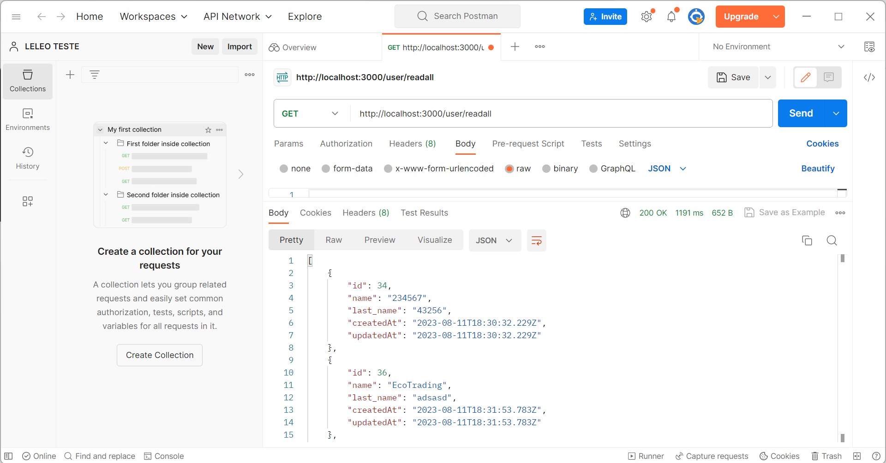
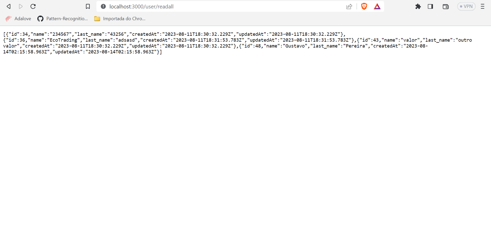
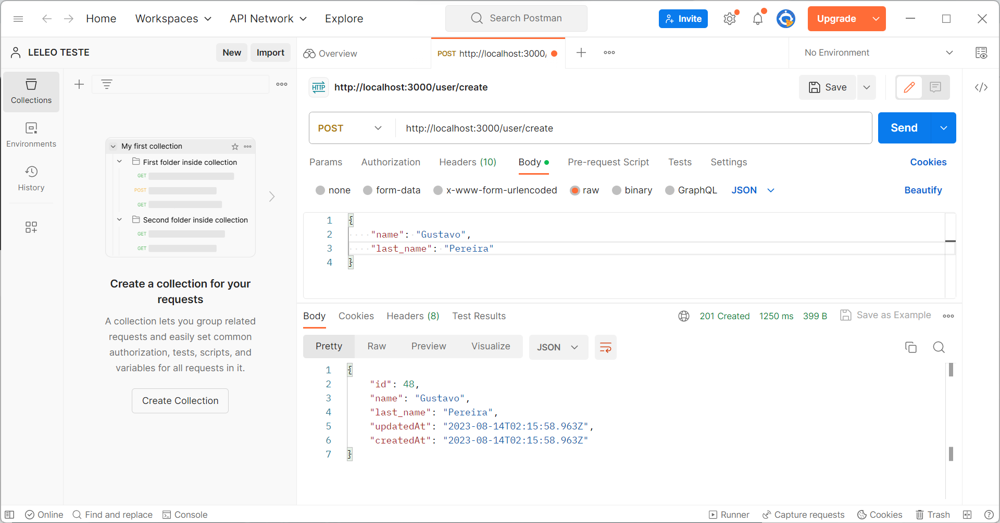
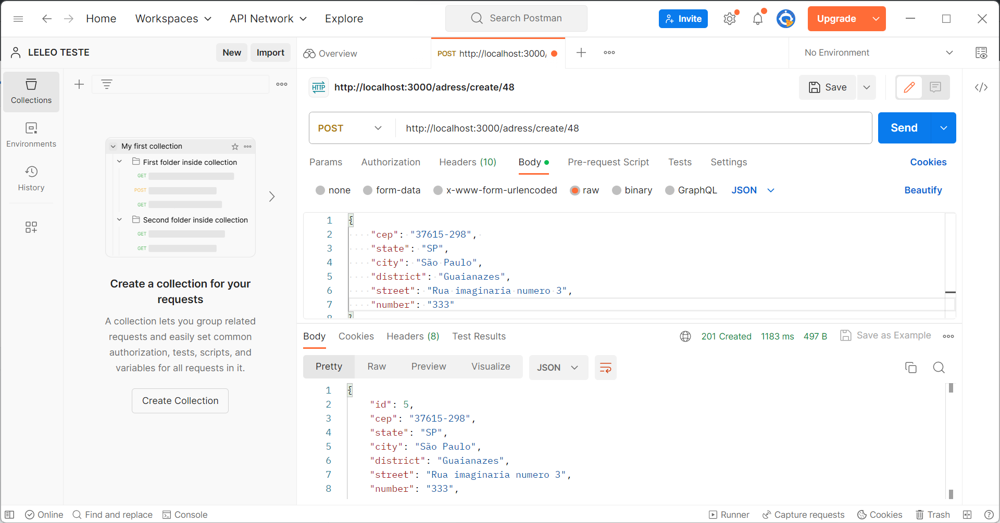
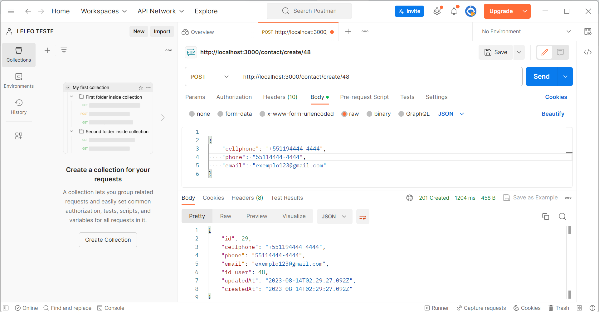
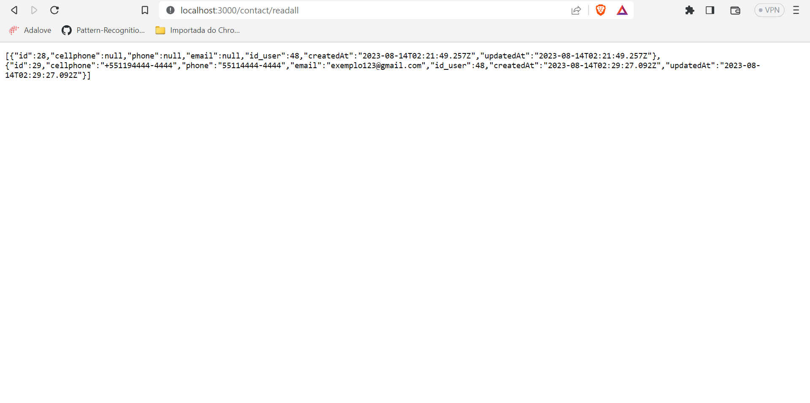
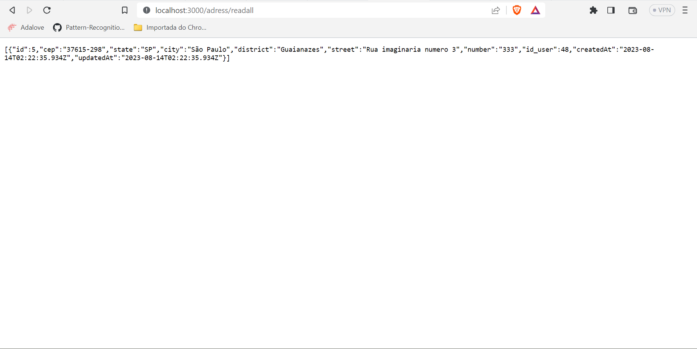
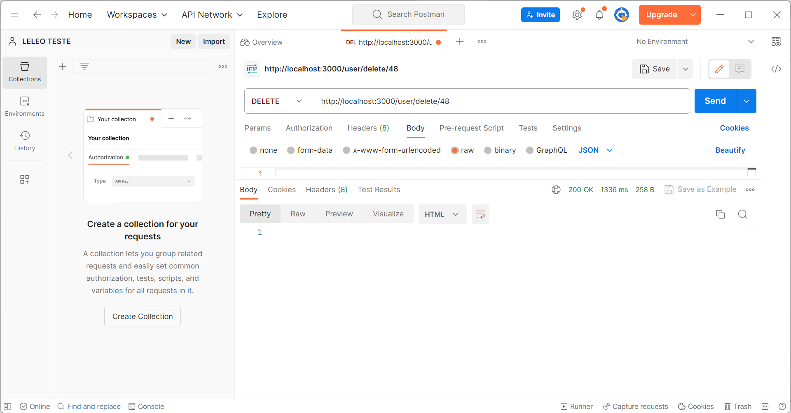

# MVP com deploy da aplicação com arquitetura simples

Este documento corresponde ao que é solicitado no card "MVP com deploy da aplicação com arquitetura básica" na Sprint 1.

Este documento deverá:

* Descrever a arquitetura da aplicação.
* Apresentar os resultados dos testes das transações REST.
* Conter os links para os dois vídeos de demonstração.

# Apresentação dos resultados das transações REST

Aqui apresentamos exemplos do funcionamento da API que criamos para interagir com o banco de dados na AWS. As demonstrações a seguir ilustram as principais operações, como GET, CREATE e DELETE, usando ferramentas como o Postman para interagir com a API.

## 1. Consulta de Usuários (GET)
Exemplo de consulta de todos os usuários utilizando o endpoint user/readall no Postman:

## 2. Visualização de Detalhes do Usuário (GET)
O usuário "Gustavo Pereira" está registrado em nosso banco de dados e pode ser facilmente visualizado utilizando a API:

## 3. Criação de Usuário (CREATE)
Demonstração de um CREATE pelo postman

Após enviar as informações pela cota user/create, podemos criar as informações de contato e endereço relacionadas ao usuário criado, passando o id no caminho da requisição

Também podemos encontrar estas informações em suas respectivas rotas pela api

## 4. Exclusão de Usuário (DELETE)
Demonstração de um DELETE pelo postman

Após apagarmos o usuário de id 48, as informações que são vinculadas a ele serão excluídas automaticamente no banco de dados.

## Link dos vídeos

- Operações do CRUD usando o console da máquina virtual:

https://drive.google.com/file/d/1qnWefiy57ZLrQhbG8xNsuCqw_aENxrmB/view?usp=sharing

- Demonstração do Front-end implementado num servidor na AWS EC2

https://drive.google.com/file/d/1W9WxSry4wA2z6kZN8RsMc6Q-w-mP0uQH/view?usp=sharing

