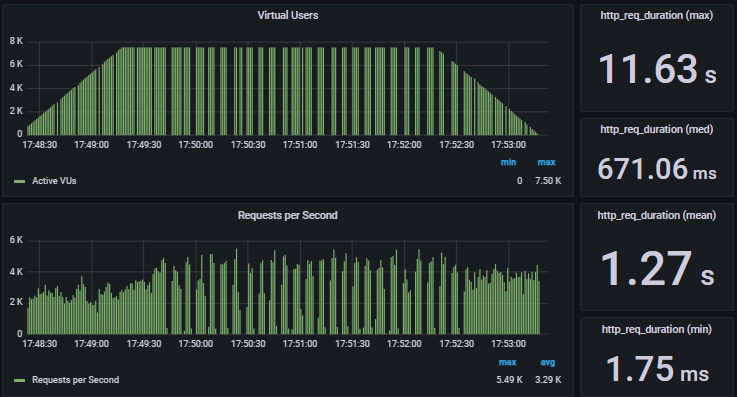

# Relatório Técnico

## Testes de Carga
Durante o desenvolvimento do projeto, conduzimos testes de carga rigorosos em nossa aplicação para avaliar seu desempenho e identificar possíveis gargalos. Esses testes forneceram insights valiosos que ajudaram a otimizar nossa infraestrutura.

Inicialmente, observamos que a aplicação estava enfrentando dificuldades de desempenho. Após uma análise mais aprofundada, descobrimos que a falta de memória disponível em nossas instâncias EC2 estava contribuindo significativamente para o problema. Para solucionar essa questão, realizamos a atualização das instâncias EC2, garantindo que elas tivessem memória suficiente para lidar com a carga de trabalho da aplicação.

No entanto, mesmo após a melhoria da memória, continuamos a observar problemas de desempenho. Foi então que direcionamos nossa atenção para o banco de dados RDS, que também era uma parte crítica de nossa infraestrutura. Após uma análise minuciosa, identificamos que o tamanho das instâncias EC2 que hospedavam o RDS estava inadequado para atender às demandas de nossa aplicação.

Para solucionar esse segundo problema, realizamos a migração do banco de dados RDS para instâncias EC2 de maior capacidade. Isso permitiu que o banco de dados atendesse de maneira eficaz às consultas e transações de dados da aplicação, resultando em um significativo aumento no desempenho geral.

Com essas melhorias na infraestrutura, conseguimos superar os desafios iniciais de desempenho e fornecer uma experiência mais rápida e confiável aos nossos usuários. Como mostrado no resultado final dos testes a seguir.

